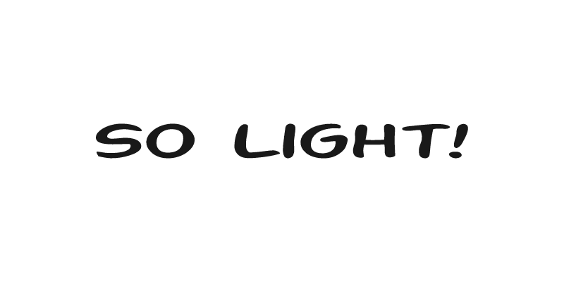

### Hi there, ahlan wa sahlan!  

#### Peace be upon you ❤️

I am **Kebal,** a software developer based in 🇲🇾. I enjoy building things and thus far had built many web-based systems. Yeah, TBH I more enjoy doing 🪄 frontend and UI/UX things! Apart of writing codes, I love to read and keep myself up-to-date with latest IT news, and consistantly improving myself to be better day-by-day in this awesome industry. 


**Backend:** Laravel, MySQL/MariaDB

**Frontend:** Vue.js, TailwindCSS, HTML5, CSS3, Bootstrap 5, Alpine.js, Nuxt.js

<!-- **Just Learn the Basic:** Nuxt.js, Flutter 🙇🏻‍♂️ -->

<!-- Looking forward to deep learn in Flutter, and AWS 🤔 -->

___

You can find me on:


```html
<picture>
  <source media="(prefers-color-scheme: dark)" srcset="https://raw.githubusercontent.com/stefanjudis/github-light-dark-image-example/main/dark.png">
  
</picture>
```

<picture>
  <source media="(prefers-color-scheme: dark)" srcset="https://raw.githubusercontent.com/stefanjudis/github-light-dark-image-example/main/dark.png">
  
</picture>


```
<picture>
  <source media="(prefers-color-scheme: dark)" srcset="./dark.png">
  
</picture>
```

<picture>
  <source media="(prefers-color-scheme: dark)" srcset="./dark.png">
  
</picture>
